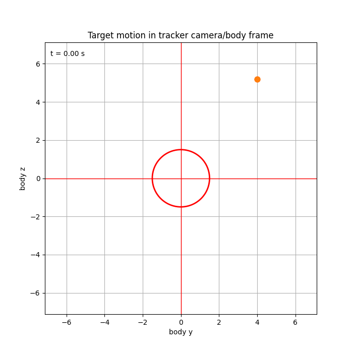

# ControlProject: Gain-Scheduled LQG Quadrotor Tracking

This project develops and tests a nonlinear quadrotor control pipeline for target tracking.

We built:
- A **9-state nonlinear quadrotor model** (velocity, attitude, and body rates)
- A **hover trim and Jacobian-based linearization** workflow
- A **gain-scheduled LQG controller** for tracking a moving target
- End-to-end simulation and visualization in `model.ipynb`

## Animations

### 1) 3D Tracker vs Target Motion
This animation shows the tracker drone following the target trajectory in 3D space under the gain-scheduled LQG controller.

### 2) Camera/Measurement View
This animation shows the camera-style relative measurement view used by the tracker while it follows the target.

## What We Did

1. Modeled quadrotor nonlinear dynamics with per-rotor thrust inputs.
2. Computed equilibrium trim at hover (`u_i = mg/4`) and linearized around operating points.
3. Built a scheduled bank of linear models/controllers for changing flight conditions.
4. Ran nonlinear closed-loop simulations with noisy measurements and state estimation.
5. Validated behavior through trajectory and camera-view animations.

## Repository Contents

- `model.ipynb` - Main notebook with model derivation, simulation, controller, and plots/animations
- `model_equations.tex` - LaTeX writeup of the quadrotor equations
- `tracker_target_3d.gif` - 3D tracking animation
- `camera_view.gif` - Camera/relative-view animation
- `lqg_regulator_colored.svg` - Regulator block-style diagram
